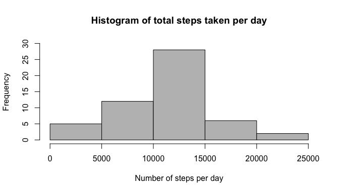
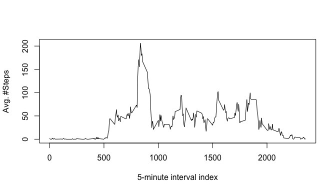
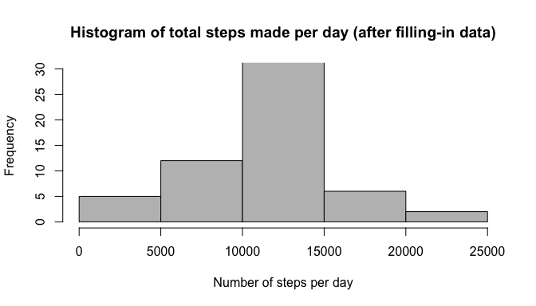
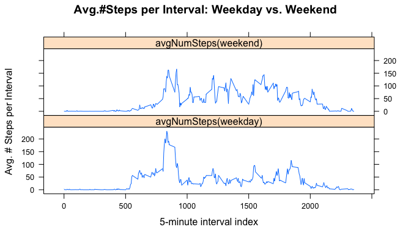

# Reproducible Research: Peer Assessment 1
## Overview
This report describes a preliminary exploratory analysis of some activity data containing the number of steps taken by a person per 5-minute interval over various days. 


## Loading and preprocessing the data
First we load the data and for convenience create a separate data set excluding the missing data values (variable "steps"):

```r
dActDat <- read.csv(file="activity.csv",sep=",",header=T)
dActDatFilt  <- filter(dActDat,!is.na(steps)) # NA-steps removed
```

## What is mean total number of steps taken per day?
In the following we show a histogram of the average number of steps per day, ignoring missing data:

```r
dStepsPerDay <- ddply(dActDatFilt,.(date),summarize,sumSteps=sum(steps))
hist(x=dStepsPerDay[,"sumSteps"],col = "gray",
     xlab = "Number of steps per day",
     main = "Histogram of total steps taken per day",ylim = c(0,30))
```



```r
meanNumSteps <- mean(dStepsPerDay[,"sumSteps"])
medianNumSteps <- median(dStepsPerDay[,"sumSteps"])
```
The mean number of steps per day is 10766.19, and the median is 
10765.

## What is the average daily activity pattern?
In order to analyze the average daily activity pattern we average the 
per-interval values over days:

```r
dAvgStepsPerInt <- ddply(dActDatFilt,.(interval),summarize,avgSteps=mean(steps))
plot(x=dAvgStepsPerInt[,"interval"],y=dAvgStepsPerInt[,"avgSteps"],type="l",
     xlab="5-minute interval index",ylab="Avg. #Steps")
```



```r
sMaxInterval <- dAvgStepsPerInt[which.max(dAvgStepsPerInt[,"avgSteps"]),1]
```
The plot shows a clear peak in activity. The interval with the most number of 
steps (on average) is the interval with index 835.

## Imputing missing values
Next we have a closer look on the missing data:

```r
sNumRowsWithNAs <- sum(rowSums(is.na(dActDat))>0)
```
There are 2304 rows with missing values. Filling in missing data 
based on the average number of steps (over days) in the corresponding time 
interval:

```r
# Interpolate missing values by the interval-mean over all days
dActDatFilled <- dActDat
vNArows <- which(is.na(dActDat[,"steps"]))
dActDatFilled[vNArows,"steps"]  <- dAvgStepsPerInt[factor(dActDat[vNArows,
                                   "interval"]),2]
```

Histogram, mean, and median after filling in missing data:

```r
dStepsPerDayAfterFilling <- ddply(dActDatFilled,.(date),summarize,
                                  sumSteps=sum(steps))
hist(x=dStepsPerDayAfterFilling[,"sumSteps"],col = "gray",
     xlab = "Number of steps per day",
     main = "Histogram of total steps made per day (after filling-in data)",
     ylim = c(0,30))
```



```r
meanNumSteps <- mean(dStepsPerDayAfterFilling[,"sumSteps"])
medianNumSteps <- median(dStepsPerDayAfterFilling[,"sumSteps"])
```
The mean number of steps per day **after filling in missing data** is 
10766.19, and the median is 10766.19.

Replacing missing data by per-interval averages had an insignificant impact on 
the median-total-steps-per-day, and hardly any impact on the 
mean-total-steps-per-day. However, the histogram naturally has more mass in the 
center. 

To see why there has been hardly any impact we analyze the missing data further:

```r
# Remove days with no valid data:
vValidDates <- unique(droplevels(dActDatFilt[,"date"]))
dActDatClean <- dActDat[dActDat[,"date"] %in% vValidDates,]
sNumRowsWithNAs_cleanedData <- sum(is.na(dActDatClean[,"steps"]))
```
There are 0 missing values in the data set 
after removing days with no valid data. In other words, none of the days with 
some valid data had any missing data. This explains why the total number of 
steps per day hardly changes after imputing the missing data.

## Are there differences in activity patterns between weekdays and weekends?
First we map the date-information to the weekday (numeric values are used for 
portability) and use these factors to obtain a data set of average per-interval
steps separately for weekdays and weekend:

```r
# Map the date to weekend/weekday
vIsWeekend <- as.POSIXlt(dActDatFilled[,"date"])$wday %in% c(0,6)
vIsWeekend[vIsWeekend==TRUE] <- "weekend"
vIsWeekend[vIsWeekend==FALSE] <- "weekday"
vIsWeekend <- as.factor(vIsWeekend)
# Calculate per-interval averages separately for weekdays and weekend:
dAvgStepsWD <-ddply(dActDatFilled[which(vIsWeekend=="weekday"),],
                    .(interval),summarize,`avgNumSteps(weekday)`=mean(steps))
dAvgStepsWE <-ddply(dActDatFilled[which(vIsWeekend=="weekend"),],
                    .(interval),summarize,`avgNumSteps(weekend)`=mean(steps))
# Merging and melting produces a single, tall data set:
dAvgStepsPerIntAfterFilling <- merge(x=dAvgStepsWD,y=dAvgStepsWE,by="interval")
dAvgStepsPerIntAfterFilling <- melt(data=dAvgStepsPerIntAfterFilling,
                                    id.vars="interval")
# Panel plot for day-pattern: weekdays vs. weekend
xyplot(value~interval|variable,data=dAvgStepsPerIntAfterFilling,type="l",
       layout=c(1,2),xlab = "5-minute interval index",
       ylab="Avg. # Steps per Interval",
       main="Avg.#Steps per Interval: Weekday vs. Weekend")
```


The activity pattern clearly differs between weekdays and weekend, e.g., there
is a clear peak in activity during the morning on weekdays, while the activity
is more evenly distributed over the day on weekends.

## Summary
During this exploratory analysis we found that missing data only occurs on days 
where there were no data recorded, and that the activity pattern differs between
weekdays and weekend.
